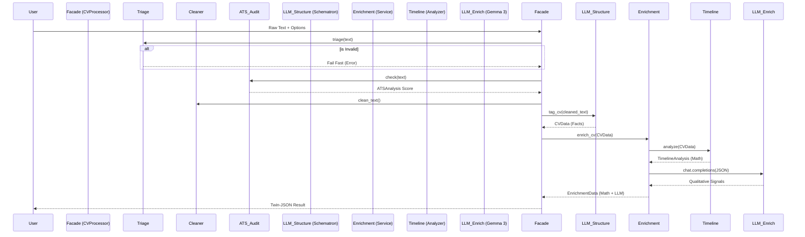

# 🏗️ System Architecture: CV-Manaiger

> **[CONTEXT: ARCHITECTURE]**
> This document describes the structural design, design patterns, and data flow of the CV-Manaiger backend.
> **Target Audience:** System Architects, Future AI Agents.

---

## 1. High-Level Design (The "Twin-Brain" System)

The system is designed as a **Linear Pipeline with a Facade**, but functionally operates as a "Twin-Brain" architecture:
1.  **Left Brain (Structure)**: `Schematron-8b`. Deterministic, fact-based, standardizing.
2.  **Right Brain (Enrichment)**: `Gemma-3-27b`. Creative, advisory, inferential.

### 1.1 The "Twin-JSON" Payload
Functionally, the system produces a split output to separate **Fact** from **Opinion**. This is the core architectural constraint.

```json
{
  "source_cv": {
    "id": "uuid-v4",
    "full_name": "Juan Perez",
    "ats_analysis": { "score": 85, "issues": ["Emojis found"] } // <-- Triage/Audit Data
  },
  "enrichment": {
    "target_cv_id": "uuid-v4",
    "timeline_analysis": { "total_years": 5.2, "stability_score": 8 }, // <-- Deterministic Math
    "market_signals": { "stack_detected": ["Django", "PostgreSQL"] }, // <-- Inferred
    "profile_signals": { "strengths": ["Stable tenure"], "risk_flags": [] } // <-- Qualitative SWOT
  }
}
```

---

## 2. Component Design (Facade Pattern)

The entry point is **`cv_formatter/main.py` -> `CVProcessor`**.
It orchestrates 7 distinct sequential steps.

### Step 0: The Gatekeeper (`etl/triage.py`)
*   **Role**: Document classification and language detection using `langdetect`.
*   **Goal**: Reject non-CV input (garbage, recipes, code snippets) before API costs.

### Step 0.5: The Inspector (`etl/ats_checker.py`)
*   **Role**: Audit for ATS-unfriendly elements (emojis, columns, symbols).
*   **Goal**: Provide a "Parsability Score" (0-100).

### Step 1: The Janitor (`etl/cleaner.py`)
*   **Role**: Normalization (NFKC), Emoji removal, bullet standardization.
*   **Goal**: Reduce noise for the LLM context window.

### Step 2: The Surgeon (`etl/section_extractor.py`)
*   **Role**: Heuristic splitting (Regex).
*   **Goal**: Identify logical blocks to optimize context.

### Step 3: The Structurer (`llm/tagger.py`)
*   **Model**: `inference-net/schematron-8b`
*   **Constraint**: "Non-Negotiable Rules" for Date/Skill extraction.
*   **Output**: Strict Pydantic `CVData` (Facts).

### Step 4: The Formatter (`formatter/json_formatter.py`)
*   **Role**: Serialization and schema validation.

### Step 5: The Coach (`enricher/engine.py` + `enricher/timeline_analyzer.py`)
*   **Layer 2.1 (Actuary)**: `TimelineAnalyzer` calculates years, average tenure, and gaps deterministically.
*   **Layer 2.2 (Creative)**: `Gemma-3-27b` generates SWOT and Career advice.
*   **Output**: Strict Pydantic `EnrichmentData`.

---

## 3. Data Flow Diagram



---

## 4. Key Decisions & Trade-offs

| Decision | Impact | Trade-off |
| :--- | :--- | :--- |
| **Facade Pattern** | Simplifies integration. | Makes internal state harder to observe without logging. |
| **Twin-JSON** | Separates concerns (Fact vs Opinion). | Requires two files/objects to get full picture. |
| **Hybrid Analysis** | Uses Math (`TimelineAnalyzer`) for dates, LLM for text. | Requires specific strict schema for dates (`YYYY-MM`). |
| **Gatekeeper** | Saves API tokens on bad input. | Might reject valid but very short/weird CVs. |

---

## 5. Directory Structure Map

```text
cv_formatter/
├── etl/                # [Process] Cleaning, Extraction, Triage, ATS Checking
├── llm/                # [AI Layer 1] Schematron/Stucture logic
├── enricher/           # [AI Layer 2] Gemma/Coach logic + Timeline Analyzer
├── formatter/          # [Schema] Data Definitions (Pydantic)
├── utils/              # [Shared] Logging, Token Counters
├── config.py           # [Env] Singleton configuration
└── main.py             # [Entry] Facade orchestration
```
